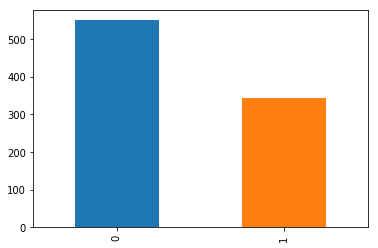
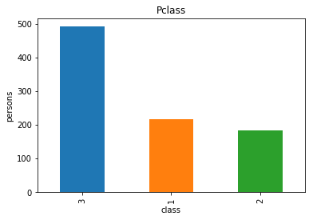
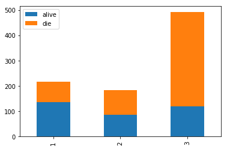
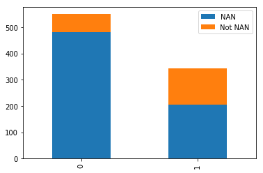
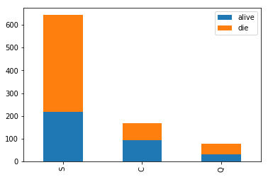
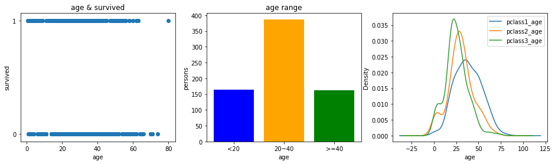
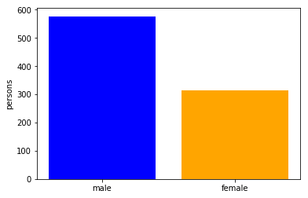
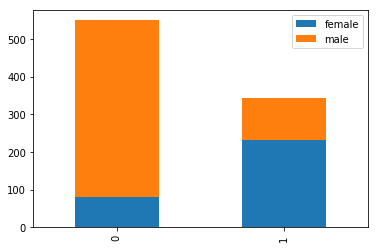
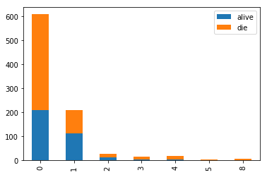
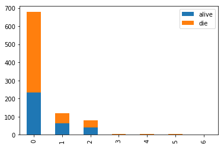

# 数据分析—泰坦尼克之灾

[** @seanlee **](https://github.com/SeanLee97)

目录：
1. 加载数据，分析数据
2. 数据清洗
3. 特征工程
4. 模型预测

## 1. 加载数据，分析数据的组成


```python
import warnings
warnings.filterwarnings("ignore")

import re
import numpy as np
import pandas as pd
import matplotlib.pyplot as plt
import random as rd
```


```python
df = pd.read_csv('./data/train.csv')
# 输出数据信息
print(df.info())
```

    <class 'pandas.core.frame.DataFrame'>
    RangeIndex: 891 entries, 0 to 890
    Data columns (total 12 columns):
    PassengerId    891 non-null int64
    Survived       891 non-null int64
    Pclass         891 non-null int64
    Name           891 non-null object
    Sex            891 non-null object
    Age            714 non-null float64
    SibSp          891 non-null int64
    Parch          891 non-null int64
    Ticket         891 non-null object
    Fare           891 non-null float64
    Cabin          204 non-null object
    Embarked       889 non-null object
    dtypes: float64(2), int64(5), object(5)
    memory usage: 83.6+ KB
    None


可以看到，数据总共有12个属性，分别是
1. 'PassengerId': 乘客编号
2. 'Survived'： 是否存活（1存活，0死亡）
3. 'Pclass'： 客舱等级 （1， 2， 3）
4. 'Name'： 乘客姓名
5. 'Sex'： 乘客性别
6. 'Age'： 乘客年龄 
7. 'SibSp'： 乘客兄弟姐妹/配偶数
8. 'Parch'： 乘客父母/子女数
9. 'Ticket': 船票号
9. 'Fare'： 船票价格
10. 'Cabin'： 舱号
11. 'Embarked'：登陆港口

得到属性后我们关心的是找到和用户存活相关的属性，也就是哪些属性影响Survived属性。

从给出的info表看到，存在数据缺失的情况，如：**Age, Cabin, Embarked**，**往往数据缺失的部分是提高整个模型的准确率的关键**，我们要做的是挖掘出丢失的数据，将其影响加入到结果预测中

### 1.1 先看值的分布


```python
df.describe()
```


<div>
<style scoped>
    .dataframe tbody tr th:only-of-type {
        vertical-align: middle;
    }

    .dataframe tbody tr th {
        vertical-align: top;
    }

    .dataframe thead th {
        text-align: right;
    }
</style>
<table border="1" class="dataframe">
  <thead>
    <tr style="text-align: right;">
      <th></th>
      <th>PassengerId</th>
      <th>Survived</th>
      <th>Pclass</th>
      <th>Age</th>
      <th>SibSp</th>
      <th>Parch</th>
      <th>Fare</th>
    </tr>
  </thead>
  <tbody>
    <tr>
      <th>count</th>
      <td>891.000000</td>
      <td>891.000000</td>
      <td>891.000000</td>
      <td>714.000000</td>
      <td>891.000000</td>
      <td>891.000000</td>
      <td>891.000000</td>
    </tr>
    <tr>
      <th>mean</th>
      <td>446.000000</td>
      <td>0.383838</td>
      <td>2.308642</td>
      <td>29.699118</td>
      <td>0.523008</td>
      <td>0.381594</td>
      <td>32.204208</td>
    </tr>
    <tr>
      <th>std</th>
      <td>257.353842</td>
      <td>0.486592</td>
      <td>0.836071</td>
      <td>14.526497</td>
      <td>1.102743</td>
      <td>0.806057</td>
      <td>49.693429</td>
    </tr>
    <tr>
      <th>min</th>
      <td>1.000000</td>
      <td>0.000000</td>
      <td>1.000000</td>
      <td>0.420000</td>
      <td>0.000000</td>
      <td>0.000000</td>
      <td>0.000000</td>
    </tr>
    <tr>
      <th>25%</th>
      <td>223.500000</td>
      <td>0.000000</td>
      <td>2.000000</td>
      <td>20.125000</td>
      <td>0.000000</td>
      <td>0.000000</td>
      <td>7.910400</td>
    </tr>
    <tr>
      <th>50%</th>
      <td>446.000000</td>
      <td>0.000000</td>
      <td>3.000000</td>
      <td>28.000000</td>
      <td>0.000000</td>
      <td>0.000000</td>
      <td>14.454200</td>
    </tr>
    <tr>
      <th>75%</th>
      <td>668.500000</td>
      <td>1.000000</td>
      <td>3.000000</td>
      <td>38.000000</td>
      <td>1.000000</td>
      <td>0.000000</td>
      <td>31.000000</td>
    </tr>
    <tr>
      <th>max</th>
      <td>891.000000</td>
      <td>1.000000</td>
      <td>3.000000</td>
      <td>80.000000</td>
      <td>8.000000</td>
      <td>6.000000</td>
      <td>512.329200</td>
    </tr>
  </tbody>
</table>
</div>


descibe() 给出了总数，均值，标准值等数据，看了头有点晕吧，好吧这里我们只是大概看一下值的范围，最后的数值的规整化才会用到

## 2. 数据的清洗

接下来逐个揭开数据的面纱！

### Survived

让我们先看看存活占比吧


```python
df.Survived.value_counts().plot(kind='bar')
print(df.Survived.value_counts().values)
plt.show()
```

    [549 342]





### PassengerId

乘客编号，一般来说编号是顺序生成的，如果是顺序生成的话，那么数据就没有多大的意义。

但是也有其他情况，比如银行排号，金、银、普卡的编号一般是不一样的，如果是按照这种方式说明PassagerId中包含了不同等级人群(感觉有点用词不当)的含义，所以一般是按区间来处理。到底属于哪种呢？我们先分析分析


```python
plt.title('PassagerId')
plt.plot(df.PassengerId)
plt.show()
```


好吧，可以看到编号是顺序生成的，所以，我们先放下这个属性

### Pclass

Pclass是舱位的等级，就好比飞机分头等舱，商务舱，普通。一般来说越高级的舱位提供的安全措施可能会比较到位，所以这应该是一个影响因素，到底是不是呢？让我们分析分析再下定论


```python
plt.title('Pclass')
plt.xlabel('class')
plt.ylabel('persons')
print(df.Pclass.value_counts())
df.Pclass.value_counts().plot(kind='bar')
plt.show()
```

    3    491
    1    216
    2    184
    Name: Pclass, dtype: int64





上面是各舱位人数分布。现在让我看看各舱位存活人数


```python
fig = plt.figure()
alive = df.Pclass[df.Survived == 1].value_counts()
die = df.Pclass[df.Survived == 0].value_counts()
print('alive')
print(alive.values)
print('die')
print(die.values)
_df = pd.DataFrame({'alive': alive, 'die': die})
_df.plot(kind='bar', stacked=True)
plt.show()
```

    alive
    [136 119  87]
    die
    [372  97  80]


    <matplotlib.figure.Figure at 0x7f7fc905b978>





可以看到3中死亡占比最高，1最少，3应该是普通舱，1应该是贵宾舱，所以舱位等级对存活造成影响

### Cabbin

舱号缺失比较严重， 先分析舱号缺失和不缺失存活占比


```python
cabin_notnull = df.Survived[pd.notnull(df.Cabin)].value_counts()
cabin_null = df.Survived[pd.isnull(df.Cabin)].value_counts()

_df = pd.DataFrame({'Not NAN': cabin_notnull, 'NAN': cabin_null})
_df.plot(kind='bar', stacked=True)
plt.show()
```





可以看到死亡的乘客中丢失舱号的占大多数，从直观上可以认为舱号数据是否丢失与存活有关联，但由于舱号大部分缺失，未知性太多，一些内部的关系不能得到确定，所以这个属性还得需要挖掘。

### Fare

船票价格


```python
df.Fare.values
```


    array([   7.25  ,   71.2833,    7.925 ,   53.1   ,    8.05  ,    8.4583,
             51.8625,   21.075 ,   11.1333,   30.0708,   16.7   ,   26.55  ,
              8.05  ,   31.275 ,    7.8542,   16.    ,   29.125 ,   13.    ,
             18.    ,    7.225 ,   26.    ,   13.    ,    8.0292,   35.5   ,
             21.075 ,   31.3875,    7.225 ,  263.    ,    7.8792,    7.8958,
             27.7208,  146.5208,    7.75  ,   10.5   ,   82.1708,   52.    ,
              7.2292,    8.05  ,   18.    ,   11.2417,    9.475 ,   21.    ,
              7.8958,   41.5792,    7.8792,    8.05  ,   15.5   ,    7.75  ,
             21.6792,   17.8   ,   39.6875,    7.8   ,   76.7292,   26.    ,
             61.9792,   35.5   ,   10.5   ,    7.2292,   27.75  ,   46.9   ,
              7.2292,   80.    ,   83.475 ,   27.9   ,   27.7208,   15.2458,
             10.5   ,    8.1583,    7.925 ,    8.6625,   10.5   ,   46.9   ,
             73.5   ,   14.4542,   56.4958,    7.65  ,    7.8958,    8.05  ,
             29.    ,   12.475 ,    9.    ,    9.5   ,    7.7875,   47.1   ,
             10.5   ,   15.85  ,   34.375 ,    8.05  ,  263.    ,    8.05  ,
              8.05  ,    7.8542,   61.175 ,   20.575 ,    7.25  ,    8.05  ,
             34.6542,   63.3583,   23.    ,   26.    ,    7.8958,    7.8958,
             77.2875,    8.6542,    7.925 ,    7.8958,    7.65  ,    7.775 ,
              7.8958,   24.15  ,   52.    ,   14.4542,    8.05  ,    9.825 ,
             14.4583,    7.925 ,    7.75  ,   21.    ,  247.5208,   31.275 ,
             73.5   ,    8.05  ,   30.0708,   13.    ,   77.2875,   11.2417,
              7.75  ,    7.1417,   22.3583,    6.975 ,    7.8958,    7.05  ,
             14.5   ,   26.    ,   13.    ,   15.0458,   26.2833,   53.1   ,
              9.2167,   79.2   ,   15.2458,    7.75  ,   15.85  ,    6.75  ,
             11.5   ,   36.75  ,    7.7958,   34.375 ,   26.    ,   13.    ,
             12.525 ,   66.6   ,    8.05  ,   14.5   ,    7.3125,   61.3792,
              7.7333,    8.05  ,    8.6625,   69.55  ,   16.1   ,   15.75  ,
              7.775 ,    8.6625,   39.6875,   20.525 ,   55.    ,   27.9   ,
             25.925 ,   56.4958,   33.5   ,   29.125 ,   11.1333,    7.925 ,
             30.6958,    7.8542,   25.4667,   28.7125,   13.    ,    0.    ,
             69.55  ,   15.05  ,   31.3875,   39.    ,   22.025 ,   50.    ,
             15.5   ,   26.55  ,   15.5   ,    7.8958,   13.    ,   13.    ,
              7.8542,   26.    ,   27.7208,  146.5208,    7.75  ,    8.4042,
              7.75  ,   13.    ,    9.5   ,   69.55  ,    6.4958,    7.225 ,
              8.05  ,   10.4625,   15.85  ,   18.7875,    7.75  ,   31.    ,
              7.05  ,   21.    ,    7.25  ,   13.    ,    7.75  ,  113.275 ,
              7.925 ,   27.    ,   76.2917,   10.5   ,    8.05  ,   13.    ,
              8.05  ,    7.8958,   90.    ,    9.35  ,   10.5   ,    7.25  ,
             13.    ,   25.4667,   83.475 ,    7.775 ,   13.5   ,   31.3875,
             10.5   ,    7.55  ,   26.    ,   26.25  ,   10.5   ,   12.275 ,
             14.4542,   15.5   ,   10.5   ,    7.125 ,    7.225 ,   90.    ,
              7.775 ,   14.5   ,   52.5542,   26.    ,    7.25  ,   10.4625,
             26.55  ,   16.1   ,   20.2125,   15.2458,   79.2   ,   86.5   ,
            512.3292,   26.    ,    7.75  ,   31.3875,   79.65  ,    0.    ,
              7.75  ,   10.5   ,   39.6875,    7.775 ,  153.4625,  135.6333,
             31.    ,    0.    ,   19.5   ,   29.7   ,    7.75  ,   77.9583,
              7.75  ,    0.    ,   29.125 ,   20.25  ,    7.75  ,    7.8542,
              9.5   ,    8.05  ,   26.    ,    8.6625,    9.5   ,    7.8958,
             13.    ,    7.75  ,   78.85  ,   91.0792,   12.875 ,    8.85  ,
              7.8958,   27.7208,    7.2292,  151.55  ,   30.5   ,  247.5208,
              7.75  ,   23.25  ,    0.    ,   12.35  ,    8.05  ,  151.55  ,
            110.8833,  108.9   ,   24.    ,   56.9292,   83.1583,  262.375 ,
             26.    ,    7.8958,   26.25  ,    7.8542,   26.    ,   14.    ,
            164.8667,  134.5   ,    7.25  ,    7.8958,   12.35  ,   29.    ,
             69.55  ,  135.6333,    6.2375,   13.    ,   20.525 ,   57.9792,
             23.25  ,   28.5   ,  153.4625,   18.    ,  133.65  ,    7.8958,
             66.6   ,  134.5   ,    8.05  ,   35.5   ,   26.    ,  263.    ,
             13.    ,   13.    ,   13.    ,   13.    ,   13.    ,   16.1   ,
             15.9   ,    8.6625,    9.225 ,   35.    ,    7.2292,   17.8   ,
              7.225 ,    9.5   ,   55.    ,   13.    ,    7.8792,    7.8792,
             27.9   ,   27.7208,   14.4542,    7.05  ,   15.5   ,    7.25  ,
             75.25  ,    7.2292,    7.75  ,   69.3   ,   55.4417,    6.4958,
              8.05  ,  135.6333,   21.075 ,   82.1708,    7.25  ,  211.5   ,
              4.0125,    7.775 ,  227.525 ,   15.7417,    7.925 ,   52.    ,
              7.8958,   73.5   ,   46.9   ,   13.    ,    7.7292,   12.    ,
            120.    ,    7.7958,    7.925 ,  113.275 ,   16.7   ,    7.7958,
              7.8542,   26.    ,   10.5   ,   12.65  ,    7.925 ,    8.05  ,
              9.825 ,   15.85  ,    8.6625,   21.    ,    7.75  ,   18.75  ,
              7.775 ,   25.4667,    7.8958,    6.8583,   90.    ,    0.    ,
              7.925 ,    8.05  ,   32.5   ,   13.    ,   13.    ,   24.15  ,
              7.8958,    7.7333,    7.875 ,   14.4   ,   20.2125,    7.25  ,
             26.    ,   26.    ,    7.75  ,    8.05  ,   26.55  ,   16.1   ,
             26.    ,    7.125 ,   55.9   ,  120.    ,   34.375 ,   18.75  ,
            263.    ,   10.5   ,   26.25  ,    9.5   ,    7.775 ,   13.    ,
              8.1125,   81.8583,   19.5   ,   26.55  ,   19.2583,   30.5   ,
             27.75  ,   19.9667,   27.75  ,   89.1042,    8.05  ,    7.8958,
             26.55  ,   51.8625,   10.5   ,    7.75  ,   26.55  ,    8.05  ,
             38.5   ,   13.    ,    8.05  ,    7.05  ,    0.    ,   26.55  ,
              7.725 ,   19.2583,    7.25  ,    8.6625,   27.75  ,   13.7917,
              9.8375,   52.    ,   21.    ,    7.0458,    7.5208,   12.2875,
             46.9   ,    0.    ,    8.05  ,    9.5875,   91.0792,   25.4667,
             90.    ,   29.7   ,    8.05  ,   15.9   ,   19.9667,    7.25  ,
             30.5   ,   49.5042,    8.05  ,   14.4583,   78.2667,   15.1   ,
            151.55  ,    7.7958,    8.6625,    7.75  ,    7.6292,    9.5875,
             86.5   ,  108.9   ,   26.    ,   26.55  ,   22.525 ,   56.4958,
              7.75  ,    8.05  ,   26.2875,   59.4   ,    7.4958,   34.0208,
             10.5   ,   24.15  ,   26.    ,    7.8958,   93.5   ,    7.8958,
              7.225 ,   57.9792,    7.2292,    7.75  ,   10.5   ,  221.7792,
              7.925 ,   11.5   ,   26.    ,    7.2292,    7.2292,   22.3583,
              8.6625,   26.25  ,   26.55  ,  106.425 ,   14.5   ,   49.5   ,
             71.    ,   31.275 ,   31.275 ,   26.    ,  106.425 ,   26.    ,
             26.    ,   13.8625,   20.525 ,   36.75  ,  110.8833,   26.    ,
              7.8292,    7.225 ,    7.775 ,   26.55  ,   39.6   ,  227.525 ,
             79.65  ,   17.4   ,    7.75  ,    7.8958,   13.5   ,    8.05  ,
              8.05  ,   24.15  ,    7.8958,   21.075 ,    7.2292,    7.8542,
             10.5   ,   51.4792,   26.3875,    7.75  ,    8.05  ,   14.5   ,
             13.    ,   55.9   ,   14.4583,    7.925 ,   30.    ,  110.8833,
             26.    ,   40.125 ,    8.7125,   79.65  ,   15.    ,   79.2   ,
              8.05  ,    8.05  ,    7.125 ,   78.2667,    7.25  ,    7.75  ,
             26.    ,   24.15  ,   33.    ,    0.    ,    7.225 ,   56.9292,
             27.    ,    7.8958,   42.4   ,    8.05  ,   26.55  ,   15.55  ,
              7.8958,   30.5   ,   41.5792,  153.4625,   31.275 ,    7.05  ,
             15.5   ,    7.75  ,    8.05  ,   65.    ,   14.4   ,   16.1   ,
             39.    ,   10.5   ,   14.4542,   52.5542,   15.7417,    7.8542,
             16.1   ,   32.3208,   12.35  ,   77.9583,    7.8958,    7.7333,
             30.    ,    7.0542,   30.5   ,    0.    ,   27.9   ,   13.    ,
              7.925 ,   26.25  ,   39.6875,   16.1   ,    7.8542,   69.3   ,
             27.9   ,   56.4958,   19.2583,   76.7292,    7.8958,   35.5   ,
              7.55  ,    7.55  ,    7.8958,   23.    ,    8.4333,    7.8292,
              6.75  ,   73.5   ,    7.8958,   15.5   ,   13.    ,  113.275 ,
            133.65  ,    7.225 ,   25.5875,    7.4958,    7.925 ,   73.5   ,
             13.    ,    7.775 ,    8.05  ,   52.    ,   39.    ,   52.    ,
             10.5   ,   13.    ,    0.    ,    7.775 ,    8.05  ,    9.8417,
             46.9   ,  512.3292,    8.1375,   76.7292,    9.225 ,   46.9   ,
             39.    ,   41.5792,   39.6875,   10.1708,    7.7958,  211.3375,
             57.    ,   13.4167,   56.4958,    7.225 ,   26.55  ,   13.5   ,
              8.05  ,    7.7333,  110.8833,    7.65  ,  227.525 ,   26.2875,
             14.4542,    7.7417,    7.8542,   26.    ,   13.5   ,   26.2875,
            151.55  ,   15.2458,   49.5042,   26.55  ,   52.    ,    9.4833,
             13.    ,    7.65  ,  227.525 ,   10.5   ,   15.5   ,    7.775 ,
             33.    ,    7.0542,   13.    ,   13.    ,   53.1   ,    8.6625,
             21.    ,    7.7375,   26.    ,    7.925 ,  211.3375,   18.7875,
              0.    ,   13.    ,   13.    ,   16.1   ,   34.375 ,  512.3292,
              7.8958,    7.8958,   30.    ,   78.85  ,  262.375 ,   16.1   ,
              7.925 ,   71.    ,   20.25  ,   13.    ,   53.1   ,    7.75  ,
             23.    ,   12.475 ,    9.5   ,    7.8958,   65.    ,   14.5   ,
              7.7958,   11.5   ,    8.05  ,   86.5   ,   14.5   ,    7.125 ,
              7.2292,  120.    ,    7.775 ,   77.9583,   39.6   ,    7.75  ,
             24.15  ,    8.3625,    9.5   ,    7.8542,   10.5   ,    7.225 ,
             23.    ,    7.75  ,    7.75  ,   12.475 ,    7.7375,  211.3375,
              7.2292,   57.    ,   30.    ,   23.45  ,    7.05  ,    7.25  ,
              7.4958,   29.125 ,   20.575 ,   79.2   ,    7.75  ,   26.    ,
             69.55  ,   30.6958,    7.8958,   13.    ,   25.9292,    8.6833,
              7.2292,   24.15  ,   13.    ,   26.25  ,  120.    ,    8.5167,
              6.975 ,    7.775 ,    0.    ,    7.775 ,   13.    ,   53.1   ,
              7.8875,   24.15  ,   10.5   ,   31.275 ,    8.05  ,    0.    ,
              7.925 ,   37.0042,    6.45  ,   27.9   ,   93.5   ,    8.6625,
              0.    ,   12.475 ,   39.6875,    6.95  ,   56.4958,   37.0042,
              7.75  ,   80.    ,   14.4542,   18.75  ,    7.2292,    7.8542,
              8.3   ,   83.1583,    8.6625,    8.05  ,   56.4958,   29.7   ,
              7.925 ,   10.5   ,   31.    ,    6.4375,    8.6625,    7.55  ,
             69.55  ,    7.8958,   33.    ,   89.1042,   31.275 ,    7.775 ,
             15.2458,   39.4   ,   26.    ,    9.35  ,  164.8667,   26.55  ,
             19.2583,    7.2292,   14.1083,   11.5   ,   25.9292,   69.55  ,
             13.    ,   13.    ,   13.8583,   50.4958,    9.5   ,   11.1333,
              7.8958,   52.5542,    5.    ,    9.    ,   24.    ,    7.225 ,
              9.8458,    7.8958,    7.8958,   83.1583,   26.    ,    7.8958,
             10.5167,   10.5   ,    7.05  ,   29.125 ,   13.    ,   30.    ,
             23.45  ,   30.    ,    7.75  ])


### Embarked

登陆港口和存活率分析


```python
alive = df.Embarked[df.Survived == 1].value_counts()
die = df.Embarked[df.Survived == 0].value_counts()

_df = pd.DataFrame({'alive': alive, 'die': die})
_df.plot(kind='bar', stacked = True)
plt.show()
```





可以看到登陆港口和存活率还是有一定关联的，而且登陆港口数据存在部分缺失，我们应该要挖掘缺失的部分的影响

### Name 

因为男生女生的姓名一般不同，给一个姓名大多数情况下可以分辨出性别。虽然分出了性别，但是Miss和Mrs.都是female称呼不同可能年龄也不同，而年龄又存在部分缺失，因此我们需要将名字考虑在内。具体的处理在特征工程部分给出


```python
df.Name.values
```


    array(['Braund, Mr. Owen Harris',
           'Cumings, Mrs. John Bradley (Florence Briggs Thayer)',
           'Heikkinen, Miss. Laina',
           'Futrelle, Mrs. Jacques Heath (Lily May Peel)',
           'Allen, Mr. William Henry', 'Moran, Mr. James',
           'McCarthy, Mr. Timothy J', 'Palsson, Master. Gosta Leonard',
           'Johnson, Mrs. Oscar W (Elisabeth Vilhelmina Berg)',
           'Nasser, Mrs. Nicholas (Adele Achem)',
           'Sandstrom, Miss. Marguerite Rut', 'Bonnell, Miss. Elizabeth',
           'Saundercock, Mr. William Henry', 'Andersson, Mr. Anders Johan',
           'Vestrom, Miss. Hulda Amanda Adolfina',
           'Hewlett, Mrs. (Mary D Kingcome) ', 'Rice, Master. Eugene',
           'Williams, Mr. Charles Eugene',
           'Vander Planke, Mrs. Julius (Emelia Maria Vandemoortele)',
           'Masselmani, Mrs. Fatima', 'Fynney, Mr. Joseph J',
           'Beesley, Mr. Lawrence', 'McGowan, Miss. Anna "Annie"',
           'Sloper, Mr. William Thompson', 'Palsson, Miss. Torborg Danira',
           'Asplund, Mrs. Carl Oscar (Selma Augusta Emilia Johansson)',
           'Emir, Mr. Farred Chehab', 'Fortune, Mr. Charles Alexander',
           'O\'Dwyer, Miss. Ellen "Nellie"', 'Todoroff, Mr. Lalio',
           'Uruchurtu, Don. Manuel E',
           'Spencer, Mrs. William Augustus (Marie Eugenie)',
           'Glynn, Miss. Mary Agatha', 'Wheadon, Mr. Edward H',
           'Meyer, Mr. Edgar Joseph', 'Holverson, Mr. Alexander Oskar',
           'Mamee, Mr. Hanna', 'Cann, Mr. Ernest Charles',
           'Vander Planke, Miss. Augusta Maria', 'Nicola-Yarred, Miss. Jamila',
           'Ahlin, Mrs. Johan (Johanna Persdotter Larsson)',
           'Turpin, Mrs. William John Robert (Dorothy Ann Wonnacott)',
           'Kraeff, Mr. Theodor', 'Laroche, Miss. Simonne Marie Anne Andree',
           'Devaney, Miss. Margaret Delia', 'Rogers, Mr. William John',
           'Lennon, Mr. Denis', "O'Driscoll, Miss. Bridget",
           'Samaan, Mr. Youssef',
           'Arnold-Franchi, Mrs. Josef (Josefine Franchi)',
           'Panula, Master. Juha Niilo', 'Nosworthy, Mr. Richard Cater',
           'Harper, Mrs. Henry Sleeper (Myna Haxtun)',
           'Faunthorpe, Mrs. Lizzie (Elizabeth Anne Wilkinson)',
           'Ostby, Mr. Engelhart Cornelius', 'Woolner, Mr. Hugh',
           'Rugg, Miss. Emily', 'Novel, Mr. Mansouer',
           'West, Miss. Constance Mirium',
           'Goodwin, Master. William Frederick', 'Sirayanian, Mr. Orsen',
           'Icard, Miss. Amelie', 'Harris, Mr. Henry Birkhardt',
           'Skoog, Master. Harald', 'Stewart, Mr. Albert A',
           'Moubarek, Master. Gerios', 'Nye, Mrs. (Elizabeth Ramell)',
           'Crease, Mr. Ernest James', 'Andersson, Miss. Erna Alexandra',
           'Kink, Mr. Vincenz', 'Jenkin, Mr. Stephen Curnow',
           'Goodwin, Miss. Lillian Amy', 'Hood, Mr. Ambrose Jr',
           'Chronopoulos, Mr. Apostolos', 'Bing, Mr. Lee',
           'Moen, Mr. Sigurd Hansen', 'Staneff, Mr. Ivan',
           'Moutal, Mr. Rahamin Haim', 'Caldwell, Master. Alden Gates',
           'Dowdell, Miss. Elizabeth', 'Waelens, Mr. Achille',
           'Sheerlinck, Mr. Jan Baptist', 'McDermott, Miss. Brigdet Delia',
           'Carrau, Mr. Francisco M', 'Ilett, Miss. Bertha',
           'Backstrom, Mrs. Karl Alfred (Maria Mathilda Gustafsson)',
           'Ford, Mr. William Neal', 'Slocovski, Mr. Selman Francis',
           'Fortune, Miss. Mabel Helen', 'Celotti, Mr. Francesco',
           'Christmann, Mr. Emil', 'Andreasson, Mr. Paul Edvin',
           'Chaffee, Mr. Herbert Fuller', 'Dean, Mr. Bertram Frank',
           'Coxon, Mr. Daniel', 'Shorney, Mr. Charles Joseph',
           'Goldschmidt, Mr. George B', 'Greenfield, Mr. William Bertram',
           'Doling, Mrs. John T (Ada Julia Bone)', 'Kantor, Mr. Sinai',
           'Petranec, Miss. Matilda', 'Petroff, Mr. Pastcho ("Pentcho")',
           'White, Mr. Richard Frasar', 'Johansson, Mr. Gustaf Joel',
           'Gustafsson, Mr. Anders Vilhelm', 'Mionoff, Mr. Stoytcho',
           'Salkjelsvik, Miss. Anna Kristine', 'Moss, Mr. Albert Johan',
           'Rekic, Mr. Tido', 'Moran, Miss. Bertha',
           'Porter, Mr. Walter Chamberlain', 'Zabour, Miss. Hileni',
           'Barton, Mr. David John', 'Jussila, Miss. Katriina',
           'Attalah, Miss. Malake', 'Pekoniemi, Mr. Edvard',
           'Connors, Mr. Patrick', 'Turpin, Mr. William John Robert',
           'Baxter, Mr. Quigg Edmond', 'Andersson, Miss. Ellis Anna Maria',
           'Hickman, Mr. Stanley George', 'Moore, Mr. Leonard Charles',
           'Nasser, Mr. Nicholas', 'Webber, Miss. Susan',
           'White, Mr. Percival Wayland', 'Nicola-Yarred, Master. Elias',
           'McMahon, Mr. Martin', 'Madsen, Mr. Fridtjof Arne',
           'Peter, Miss. Anna', 'Ekstrom, Mr. Johan', 'Drazenoic, Mr. Jozef',
           'Coelho, Mr. Domingos Fernandeo',
           'Robins, Mrs. Alexander A (Grace Charity Laury)',
           'Weisz, Mrs. Leopold (Mathilde Francoise Pede)',
           'Sobey, Mr. Samuel James Hayden', 'Richard, Mr. Emile',
           'Newsom, Miss. Helen Monypeny', 'Futrelle, Mr. Jacques Heath',
           'Osen, Mr. Olaf Elon', 'Giglio, Mr. Victor',
           'Boulos, Mrs. Joseph (Sultana)', 'Nysten, Miss. Anna Sofia',
           'Hakkarainen, Mrs. Pekka Pietari (Elin Matilda Dolck)',
           'Burke, Mr. Jeremiah', 'Andrew, Mr. Edgardo Samuel',
           'Nicholls, Mr. Joseph Charles',
           'Andersson, Mr. August Edvard ("Wennerstrom")',
           'Ford, Miss. Robina Maggie "Ruby"',
           'Navratil, Mr. Michel ("Louis M Hoffman")',
           'Byles, Rev. Thomas Roussel Davids', 'Bateman, Rev. Robert James',
           'Pears, Mrs. Thomas (Edith Wearne)', 'Meo, Mr. Alfonzo',
           'van Billiard, Mr. Austin Blyler', 'Olsen, Mr. Ole Martin',
           'Williams, Mr. Charles Duane', 'Gilnagh, Miss. Katherine "Katie"',
           'Corn, Mr. Harry', 'Smiljanic, Mr. Mile',
           'Sage, Master. Thomas Henry', 'Cribb, Mr. John Hatfield',
           'Watt, Mrs. James (Elizabeth "Bessie" Inglis Milne)',
           'Bengtsson, Mr. John Viktor', 'Calic, Mr. Jovo',
           'Panula, Master. Eino Viljami',
           'Goldsmith, Master. Frank John William "Frankie"',
           'Chibnall, Mrs. (Edith Martha Bowerman)',
           'Skoog, Mrs. William (Anna Bernhardina Karlsson)',
           'Baumann, Mr. John D', 'Ling, Mr. Lee', 'Van der hoef, Mr. Wyckoff',
           'Rice, Master. Arthur', 'Johnson, Miss. Eleanor Ileen',
           'Sivola, Mr. Antti Wilhelm', 'Smith, Mr. James Clinch',
           'Klasen, Mr. Klas Albin', 'Lefebre, Master. Henry Forbes',
           'Isham, Miss. Ann Elizabeth', 'Hale, Mr. Reginald',
           'Leonard, Mr. Lionel', 'Sage, Miss. Constance Gladys',
           'Pernot, Mr. Rene', 'Asplund, Master. Clarence Gustaf Hugo',
           'Becker, Master. Richard F', 'Kink-Heilmann, Miss. Luise Gretchen',
           'Rood, Mr. Hugh Roscoe',
           'O\'Brien, Mrs. Thomas (Johanna "Hannah" Godfrey)',
           'Romaine, Mr. Charles Hallace ("Mr C Rolmane")', 'Bourke, Mr. John',
           'Turcin, Mr. Stjepan', 'Pinsky, Mrs. (Rosa)',
           'Carbines, Mr. William',
           'Andersen-Jensen, Miss. Carla Christine Nielsine',
           'Navratil, Master. Michel M',
           'Brown, Mrs. James Joseph (Margaret Tobin)', 'Lurette, Miss. Elise',
           'Mernagh, Mr. Robert', 'Olsen, Mr. Karl Siegwart Andreas',
           'Madigan, Miss. Margaret "Maggie"',
           'Yrois, Miss. Henriette ("Mrs Harbeck")',
           'Vande Walle, Mr. Nestor Cyriel', 'Sage, Mr. Frederick',
           'Johanson, Mr. Jakob Alfred', 'Youseff, Mr. Gerious',
           'Cohen, Mr. Gurshon "Gus"', 'Strom, Miss. Telma Matilda',
           'Backstrom, Mr. Karl Alfred', 'Albimona, Mr. Nassef Cassem',
           'Carr, Miss. Helen "Ellen"', 'Blank, Mr. Henry', 'Ali, Mr. Ahmed',
           'Cameron, Miss. Clear Annie', 'Perkin, Mr. John Henry',
           'Givard, Mr. Hans Kristensen', 'Kiernan, Mr. Philip',
           'Newell, Miss. Madeleine', 'Honkanen, Miss. Eliina',
           'Jacobsohn, Mr. Sidney Samuel', 'Bazzani, Miss. Albina',
           'Harris, Mr. Walter', 'Sunderland, Mr. Victor Francis',
           'Bracken, Mr. James H', 'Green, Mr. George Henry',
           'Nenkoff, Mr. Christo', 'Hoyt, Mr. Frederick Maxfield',
           'Berglund, Mr. Karl Ivar Sven', 'Mellors, Mr. William John',
           'Lovell, Mr. John Hall ("Henry")', 'Fahlstrom, Mr. Arne Jonas',
           'Lefebre, Miss. Mathilde',
           'Harris, Mrs. Henry Birkhardt (Irene Wallach)',
           'Larsson, Mr. Bengt Edvin', 'Sjostedt, Mr. Ernst Adolf',
           'Asplund, Miss. Lillian Gertrud',
           'Leyson, Mr. Robert William Norman', 'Harknett, Miss. Alice Phoebe',
           'Hold, Mr. Stephen', 'Collyer, Miss. Marjorie "Lottie"',
           'Pengelly, Mr. Frederick William', 'Hunt, Mr. George Henry',
           'Zabour, Miss. Thamine', 'Murphy, Miss. Katherine "Kate"',
           'Coleridge, Mr. Reginald Charles', 'Maenpaa, Mr. Matti Alexanteri',
           'Attalah, Mr. Sleiman', 'Minahan, Dr. William Edward',
           'Lindahl, Miss. Agda Thorilda Viktoria',
           'Hamalainen, Mrs. William (Anna)', 'Beckwith, Mr. Richard Leonard',
           'Carter, Rev. Ernest Courtenay', 'Reed, Mr. James George',
           'Strom, Mrs. Wilhelm (Elna Matilda Persson)',
           'Stead, Mr. William Thomas', 'Lobb, Mr. William Arthur',
           'Rosblom, Mrs. Viktor (Helena Wilhelmina)',
           'Touma, Mrs. Darwis (Hanne Youssef Razi)',
           'Thorne, Mrs. Gertrude Maybelle', 'Cherry, Miss. Gladys',
           'Ward, Miss. Anna', 'Parrish, Mrs. (Lutie Davis)',
           'Smith, Mr. Thomas', 'Asplund, Master. Edvin Rojj Felix',
           'Taussig, Mr. Emil', 'Harrison, Mr. William', 'Henry, Miss. Delia',
           'Reeves, Mr. David', 'Panula, Mr. Ernesti Arvid',
           'Persson, Mr. Ernst Ulrik',
           'Graham, Mrs. William Thompson (Edith Junkins)',
           'Bissette, Miss. Amelia', 'Cairns, Mr. Alexander',
           'Tornquist, Mr. William Henry',
           'Mellinger, Mrs. (Elizabeth Anne Maidment)',
           'Natsch, Mr. Charles H', 'Healy, Miss. Hanora "Nora"',
           'Andrews, Miss. Kornelia Theodosia',
           'Lindblom, Miss. Augusta Charlotta', 'Parkes, Mr. Francis "Frank"',
           'Rice, Master. Eric', 'Abbott, Mrs. Stanton (Rosa Hunt)',
           'Duane, Mr. Frank', 'Olsson, Mr. Nils Johan Goransson',
           'de Pelsmaeker, Mr. Alfons', 'Dorking, Mr. Edward Arthur',
           'Smith, Mr. Richard William', 'Stankovic, Mr. Ivan',
           'de Mulder, Mr. Theodore', 'Naidenoff, Mr. Penko',
           'Hosono, Mr. Masabumi', 'Connolly, Miss. Kate',
           'Barber, Miss. Ellen "Nellie"',
           'Bishop, Mrs. Dickinson H (Helen Walton)', 'Levy, Mr. Rene Jacques',
           'Haas, Miss. Aloisia', 'Mineff, Mr. Ivan', 'Lewy, Mr. Ervin G',
           'Hanna, Mr. Mansour', 'Allison, Miss. Helen Loraine',
           'Saalfeld, Mr. Adolphe',
           'Baxter, Mrs. James (Helene DeLaudeniere Chaput)',
           'Kelly, Miss. Anna Katherine "Annie Kate"', 'McCoy, Mr. Bernard',
           'Johnson, Mr. William Cahoone Jr', 'Keane, Miss. Nora A',
           'Williams, Mr. Howard Hugh "Harry"',
           'Allison, Master. Hudson Trevor', 'Fleming, Miss. Margaret',
           'Penasco y Castellana, Mrs. Victor de Satode (Maria Josefa Perez de Soto y Vallejo)',
           'Abelson, Mr. Samuel', 'Francatelli, Miss. Laura Mabel',
           'Hays, Miss. Margaret Bechstein', 'Ryerson, Miss. Emily Borie',
           'Lahtinen, Mrs. William (Anna Sylfven)', 'Hendekovic, Mr. Ignjac',
           'Hart, Mr. Benjamin', 'Nilsson, Miss. Helmina Josefina',
           'Kantor, Mrs. Sinai (Miriam Sternin)', 'Moraweck, Dr. Ernest',
           'Wick, Miss. Mary Natalie',
           'Spedden, Mrs. Frederic Oakley (Margaretta Corning Stone)',
           'Dennis, Mr. Samuel', 'Danoff, Mr. Yoto',
           'Slayter, Miss. Hilda Mary',
           'Caldwell, Mrs. Albert Francis (Sylvia Mae Harbaugh)',
           'Sage, Mr. George John Jr', 'Young, Miss. Marie Grice',
           'Nysveen, Mr. Johan Hansen', 'Ball, Mrs. (Ada E Hall)',
           'Goldsmith, Mrs. Frank John (Emily Alice Brown)',
           'Hippach, Miss. Jean Gertrude', 'McCoy, Miss. Agnes',
           'Partner, Mr. Austen', 'Graham, Mr. George Edward',
           'Vander Planke, Mr. Leo Edmondus',
           'Frauenthal, Mrs. Henry William (Clara Heinsheimer)',
           'Denkoff, Mr. Mitto', 'Pears, Mr. Thomas Clinton',
           'Burns, Miss. Elizabeth Margaret', 'Dahl, Mr. Karl Edwart',
           'Blackwell, Mr. Stephen Weart', 'Navratil, Master. Edmond Roger',
           'Fortune, Miss. Alice Elizabeth', 'Collander, Mr. Erik Gustaf',
           'Sedgwick, Mr. Charles Frederick Waddington',
           'Fox, Mr. Stanley Hubert', 'Brown, Miss. Amelia "Mildred"',
           'Smith, Miss. Marion Elsie',
           'Davison, Mrs. Thomas Henry (Mary E Finck)',
           'Coutts, Master. William Loch "William"', 'Dimic, Mr. Jovan',
           'Odahl, Mr. Nils Martin', 'Williams-Lambert, Mr. Fletcher Fellows',
           'Elias, Mr. Tannous', 'Arnold-Franchi, Mr. Josef',
           'Yousif, Mr. Wazli', 'Vanden Steen, Mr. Leo Peter',
           'Bowerman, Miss. Elsie Edith', 'Funk, Miss. Annie Clemmer',
           'McGovern, Miss. Mary', 'Mockler, Miss. Helen Mary "Ellie"',
           'Skoog, Mr. Wilhelm', 'del Carlo, Mr. Sebastiano',
           'Barbara, Mrs. (Catherine David)', 'Asim, Mr. Adola',
           "O'Brien, Mr. Thomas", 'Adahl, Mr. Mauritz Nils Martin',
           'Warren, Mrs. Frank Manley (Anna Sophia Atkinson)',
           'Moussa, Mrs. (Mantoura Boulos)', 'Jermyn, Miss. Annie',
           'Aubart, Mme. Leontine Pauline', 'Harder, Mr. George Achilles',
           'Wiklund, Mr. Jakob Alfred', 'Beavan, Mr. William Thomas',
           'Ringhini, Mr. Sante', 'Palsson, Miss. Stina Viola',
           'Meyer, Mrs. Edgar Joseph (Leila Saks)',
           'Landergren, Miss. Aurora Adelia', 'Widener, Mr. Harry Elkins',
           'Betros, Mr. Tannous', 'Gustafsson, Mr. Karl Gideon',
           'Bidois, Miss. Rosalie', 'Nakid, Miss. Maria ("Mary")',
           'Tikkanen, Mr. Juho',
           'Holverson, Mrs. Alexander Oskar (Mary Aline Towner)',
           'Plotcharsky, Mr. Vasil', 'Davies, Mr. Charles Henry',
           'Goodwin, Master. Sidney Leonard', 'Buss, Miss. Kate',
           'Sadlier, Mr. Matthew', 'Lehmann, Miss. Bertha',
           'Carter, Mr. William Ernest', 'Jansson, Mr. Carl Olof',
           'Gustafsson, Mr. Johan Birger', 'Newell, Miss. Marjorie',
           'Sandstrom, Mrs. Hjalmar (Agnes Charlotta Bengtsson)',
           'Johansson, Mr. Erik', 'Olsson, Miss. Elina',
           'McKane, Mr. Peter David', 'Pain, Dr. Alfred',
           'Trout, Mrs. William H (Jessie L)', 'Niskanen, Mr. Juha',
           'Adams, Mr. John', 'Jussila, Miss. Mari Aina',
           'Hakkarainen, Mr. Pekka Pietari', 'Oreskovic, Miss. Marija',
           'Gale, Mr. Shadrach', 'Widegren, Mr. Carl/Charles Peter',
           'Richards, Master. William Rowe',
           'Birkeland, Mr. Hans Martin Monsen', 'Lefebre, Miss. Ida',
           'Sdycoff, Mr. Todor', 'Hart, Mr. Henry', 'Minahan, Miss. Daisy E',
           'Cunningham, Mr. Alfred Fleming', 'Sundman, Mr. Johan Julian',
           'Meek, Mrs. Thomas (Annie Louise Rowley)',
           'Drew, Mrs. James Vivian (Lulu Thorne Christian)',
           'Silven, Miss. Lyyli Karoliina', 'Matthews, Mr. William John',
           'Van Impe, Miss. Catharina', 'Gheorgheff, Mr. Stanio',
           'Charters, Mr. David', 'Zimmerman, Mr. Leo',
           'Danbom, Mrs. Ernst Gilbert (Anna Sigrid Maria Brogren)',
           'Rosblom, Mr. Viktor Richard', 'Wiseman, Mr. Phillippe',
           'Clarke, Mrs. Charles V (Ada Maria Winfield)',
           'Phillips, Miss. Kate Florence ("Mrs Kate Louise Phillips Marshall")',
           'Flynn, Mr. James', 'Pickard, Mr. Berk (Berk Trembisky)',
           'Bjornstrom-Steffansson, Mr. Mauritz Hakan',
           'Thorneycroft, Mrs. Percival (Florence Kate White)',
           'Louch, Mrs. Charles Alexander (Alice Adelaide Slow)',
           'Kallio, Mr. Nikolai Erland', 'Silvey, Mr. William Baird',
           'Carter, Miss. Lucile Polk', 'Ford, Miss. Doolina Margaret "Daisy"',
           'Richards, Mrs. Sidney (Emily Hocking)', 'Fortune, Mr. Mark',
           'Kvillner, Mr. Johan Henrik Johannesson',
           'Hart, Mrs. Benjamin (Esther Ada Bloomfield)', 'Hampe, Mr. Leon',
           'Petterson, Mr. Johan Emil', 'Reynaldo, Ms. Encarnacion',
           'Johannesen-Bratthammer, Mr. Bernt', 'Dodge, Master. Washington',
           'Mellinger, Miss. Madeleine Violet', 'Seward, Mr. Frederic Kimber',
           'Baclini, Miss. Marie Catherine', 'Peuchen, Major. Arthur Godfrey',
           'West, Mr. Edwy Arthur', 'Hagland, Mr. Ingvald Olai Olsen',
           'Foreman, Mr. Benjamin Laventall', 'Goldenberg, Mr. Samuel L',
           'Peduzzi, Mr. Joseph', 'Jalsevac, Mr. Ivan',
           'Millet, Mr. Francis Davis', 'Kenyon, Mrs. Frederick R (Marion)',
           'Toomey, Miss. Ellen', "O'Connor, Mr. Maurice",
           'Anderson, Mr. Harry', 'Morley, Mr. William', 'Gee, Mr. Arthur H',
           'Milling, Mr. Jacob Christian', 'Maisner, Mr. Simon',
           'Goncalves, Mr. Manuel Estanslas', 'Campbell, Mr. William',
           'Smart, Mr. John Montgomery', 'Scanlan, Mr. James',
           'Baclini, Miss. Helene Barbara', 'Keefe, Mr. Arthur',
           'Cacic, Mr. Luka', 'West, Mrs. Edwy Arthur (Ada Mary Worth)',
           'Jerwan, Mrs. Amin S (Marie Marthe Thuillard)',
           'Strandberg, Miss. Ida Sofia', 'Clifford, Mr. George Quincy',
           'Renouf, Mr. Peter Henry', 'Braund, Mr. Lewis Richard',
           'Karlsson, Mr. Nils August', 'Hirvonen, Miss. Hildur E',
           'Goodwin, Master. Harold Victor',
           'Frost, Mr. Anthony Wood "Archie"', 'Rouse, Mr. Richard Henry',
           'Turkula, Mrs. (Hedwig)', 'Bishop, Mr. Dickinson H',
           'Lefebre, Miss. Jeannie',
           'Hoyt, Mrs. Frederick Maxfield (Jane Anne Forby)',
           'Kent, Mr. Edward Austin', 'Somerton, Mr. Francis William',
           'Coutts, Master. Eden Leslie "Neville"',
           'Hagland, Mr. Konrad Mathias Reiersen', 'Windelov, Mr. Einar',
           'Molson, Mr. Harry Markland', 'Artagaveytia, Mr. Ramon',
           'Stanley, Mr. Edward Roland', 'Yousseff, Mr. Gerious',
           'Eustis, Miss. Elizabeth Mussey', 'Shellard, Mr. Frederick William',
           'Allison, Mrs. Hudson J C (Bessie Waldo Daniels)',
           'Svensson, Mr. Olof', 'Calic, Mr. Petar', 'Canavan, Miss. Mary',
           "O'Sullivan, Miss. Bridget Mary", 'Laitinen, Miss. Kristina Sofia',
           'Maioni, Miss. Roberta',
           'Penasco y Castellana, Mr. Victor de Satode',
           'Quick, Mrs. Frederick Charles (Jane Richards)',
           'Bradley, Mr. George ("George Arthur Brayton")',
           'Olsen, Mr. Henry Margido', 'Lang, Mr. Fang',
           'Daly, Mr. Eugene Patrick', 'Webber, Mr. James',
           'McGough, Mr. James Robert',
           'Rothschild, Mrs. Martin (Elizabeth L. Barrett)',
           'Coleff, Mr. Satio', 'Walker, Mr. William Anderson',
           'Lemore, Mrs. (Amelia Milley)', 'Ryan, Mr. Patrick',
           'Angle, Mrs. William A (Florence "Mary" Agnes Hughes)',
           'Pavlovic, Mr. Stefo', 'Perreault, Miss. Anne', 'Vovk, Mr. Janko',
           'Lahoud, Mr. Sarkis',
           'Hippach, Mrs. Louis Albert (Ida Sophia Fischer)',
           'Kassem, Mr. Fared', 'Farrell, Mr. James', 'Ridsdale, Miss. Lucy',
           'Farthing, Mr. John', 'Salonen, Mr. Johan Werner',
           'Hocking, Mr. Richard George', 'Quick, Miss. Phyllis May',
           'Toufik, Mr. Nakli', 'Elias, Mr. Joseph Jr',
           'Peter, Mrs. Catherine (Catherine Rizk)', 'Cacic, Miss. Marija',
           'Hart, Miss. Eva Miriam', 'Butt, Major. Archibald Willingham',
           'LeRoy, Miss. Bertha', 'Risien, Mr. Samuel Beard',
           'Frolicher, Miss. Hedwig Margaritha', 'Crosby, Miss. Harriet R',
           'Andersson, Miss. Ingeborg Constanzia',
           'Andersson, Miss. Sigrid Elisabeth', 'Beane, Mr. Edward',
           'Douglas, Mr. Walter Donald', 'Nicholson, Mr. Arthur Ernest',
           'Beane, Mrs. Edward (Ethel Clarke)', 'Padro y Manent, Mr. Julian',
           'Goldsmith, Mr. Frank John', 'Davies, Master. John Morgan Jr',
           'Thayer, Mr. John Borland Jr', 'Sharp, Mr. Percival James R',
           "O'Brien, Mr. Timothy", 'Leeni, Mr. Fahim ("Philip Zenni")',
           'Ohman, Miss. Velin', 'Wright, Mr. George',
           'Duff Gordon, Lady. (Lucille Christiana Sutherland) ("Mrs Morgan")',
           'Robbins, Mr. Victor', 'Taussig, Mrs. Emil (Tillie Mandelbaum)',
           'de Messemaeker, Mrs. Guillaume Joseph (Emma)',
           'Morrow, Mr. Thomas Rowan', 'Sivic, Mr. Husein',
           'Norman, Mr. Robert Douglas', 'Simmons, Mr. John',
           'Meanwell, Miss. (Marion Ogden)', 'Davies, Mr. Alfred J',
           'Stoytcheff, Mr. Ilia',
           'Palsson, Mrs. Nils (Alma Cornelia Berglund)',
           'Doharr, Mr. Tannous', 'Jonsson, Mr. Carl', 'Harris, Mr. George',
           'Appleton, Mrs. Edward Dale (Charlotte Lamson)',
           'Flynn, Mr. John Irwin ("Irving")', 'Kelly, Miss. Mary',
           'Rush, Mr. Alfred George John', 'Patchett, Mr. George',
           'Garside, Miss. Ethel', 'Silvey, Mrs. William Baird (Alice Munger)',
           'Caram, Mrs. Joseph (Maria Elias)', 'Jussila, Mr. Eiriik',
           'Christy, Miss. Julie Rachel',
           'Thayer, Mrs. John Borland (Marian Longstreth Morris)',
           'Downton, Mr. William James', 'Ross, Mr. John Hugo',
           'Paulner, Mr. Uscher', 'Taussig, Miss. Ruth',
           'Jarvis, Mr. John Denzil', 'Frolicher-Stehli, Mr. Maxmillian',
           'Gilinski, Mr. Eliezer', 'Murdlin, Mr. Joseph',
           'Rintamaki, Mr. Matti',
           'Stephenson, Mrs. Walter Bertram (Martha Eustis)',
           'Elsbury, Mr. William James', 'Bourke, Miss. Mary',
           'Chapman, Mr. John Henry', 'Van Impe, Mr. Jean Baptiste',
           'Leitch, Miss. Jessie Wills', 'Johnson, Mr. Alfred',
           'Boulos, Mr. Hanna', 'Duff Gordon, Sir. Cosmo Edmund ("Mr Morgan")',
           'Jacobsohn, Mrs. Sidney Samuel (Amy Frances Christy)',
           'Slabenoff, Mr. Petco', 'Harrington, Mr. Charles H',
           'Torber, Mr. Ernst William', 'Homer, Mr. Harry ("Mr E Haven")',
           'Lindell, Mr. Edvard Bengtsson', 'Karaic, Mr. Milan',
           'Daniel, Mr. Robert Williams',
           'Laroche, Mrs. Joseph (Juliette Marie Louise Lafargue)',
           'Shutes, Miss. Elizabeth W',
           'Andersson, Mrs. Anders Johan (Alfrida Konstantia Brogren)',
           'Jardin, Mr. Jose Neto', 'Murphy, Miss. Margaret Jane',
           'Horgan, Mr. John', 'Brocklebank, Mr. William Alfred',
           'Herman, Miss. Alice', 'Danbom, Mr. Ernst Gilbert',
           'Lobb, Mrs. William Arthur (Cordelia K Stanlick)',
           'Becker, Miss. Marion Louise', 'Gavey, Mr. Lawrence',
           'Yasbeck, Mr. Antoni', 'Kimball, Mr. Edwin Nelson Jr',
           'Nakid, Mr. Sahid', 'Hansen, Mr. Henry Damsgaard',
           'Bowen, Mr. David John "Dai"', 'Sutton, Mr. Frederick',
           'Kirkland, Rev. Charles Leonard', 'Longley, Miss. Gretchen Fiske',
           'Bostandyeff, Mr. Guentcho', "O'Connell, Mr. Patrick D",
           'Barkworth, Mr. Algernon Henry Wilson',
           'Lundahl, Mr. Johan Svensson', 'Stahelin-Maeglin, Dr. Max',
           'Parr, Mr. William Henry Marsh', 'Skoog, Miss. Mabel',
           'Davis, Miss. Mary', 'Leinonen, Mr. Antti Gustaf',
           'Collyer, Mr. Harvey', 'Panula, Mrs. Juha (Maria Emilia Ojala)',
           'Thorneycroft, Mr. Percival', 'Jensen, Mr. Hans Peder',
           'Sagesser, Mlle. Emma', 'Skoog, Miss. Margit Elizabeth',
           'Foo, Mr. Choong', 'Baclini, Miss. Eugenie',
           'Harper, Mr. Henry Sleeper', 'Cor, Mr. Liudevit',
           'Simonius-Blumer, Col. Oberst Alfons', 'Willey, Mr. Edward',
           'Stanley, Miss. Amy Zillah Elsie', 'Mitkoff, Mr. Mito',
           'Doling, Miss. Elsie', 'Kalvik, Mr. Johannes Halvorsen',
           'O\'Leary, Miss. Hanora "Norah"', 'Hegarty, Miss. Hanora "Nora"',
           'Hickman, Mr. Leonard Mark', 'Radeff, Mr. Alexander',
           'Bourke, Mrs. John (Catherine)', 'Eitemiller, Mr. George Floyd',
           'Newell, Mr. Arthur Webster', 'Frauenthal, Dr. Henry William',
           'Badt, Mr. Mohamed', 'Colley, Mr. Edward Pomeroy',
           'Coleff, Mr. Peju', 'Lindqvist, Mr. Eino William',
           'Hickman, Mr. Lewis', 'Butler, Mr. Reginald Fenton',
           'Rommetvedt, Mr. Knud Paust', 'Cook, Mr. Jacob',
           'Taylor, Mrs. Elmer Zebley (Juliet Cummins Wright)',
           'Brown, Mrs. Thomas William Solomon (Elizabeth Catherine Ford)',
           'Davidson, Mr. Thornton', 'Mitchell, Mr. Henry Michael',
           'Wilhelms, Mr. Charles', 'Watson, Mr. Ennis Hastings',
           'Edvardsson, Mr. Gustaf Hjalmar', 'Sawyer, Mr. Frederick Charles',
           'Turja, Miss. Anna Sofia',
           'Goodwin, Mrs. Frederick (Augusta Tyler)',
           'Cardeza, Mr. Thomas Drake Martinez', 'Peters, Miss. Katie',
           'Hassab, Mr. Hammad', 'Olsvigen, Mr. Thor Anderson',
           'Goodwin, Mr. Charles Edward', 'Brown, Mr. Thomas William Solomon',
           'Laroche, Mr. Joseph Philippe Lemercier',
           'Panula, Mr. Jaako Arnold', 'Dakic, Mr. Branko',
           'Fischer, Mr. Eberhard Thelander',
           'Madill, Miss. Georgette Alexandra', 'Dick, Mr. Albert Adrian',
           'Karun, Miss. Manca', 'Lam, Mr. Ali', 'Saad, Mr. Khalil',
           'Weir, Col. John', 'Chapman, Mr. Charles Henry', 'Kelly, Mr. James',
           'Mullens, Miss. Katherine "Katie"', 'Thayer, Mr. John Borland',
           'Humblen, Mr. Adolf Mathias Nicolai Olsen',
           'Astor, Mrs. John Jacob (Madeleine Talmadge Force)',
           'Silverthorne, Mr. Spencer Victor', 'Barbara, Miss. Saiide',
           'Gallagher, Mr. Martin', 'Hansen, Mr. Henrik Juul',
           'Morley, Mr. Henry Samuel ("Mr Henry Marshall")',
           'Kelly, Mrs. Florence "Fannie"',
           'Calderhead, Mr. Edward Pennington', 'Cleaver, Miss. Alice',
           'Moubarek, Master. Halim Gonios ("William George")',
           'Mayne, Mlle. Berthe Antonine ("Mrs de Villiers")',
           'Klaber, Mr. Herman', 'Taylor, Mr. Elmer Zebley',
           'Larsson, Mr. August Viktor', 'Greenberg, Mr. Samuel',
           'Soholt, Mr. Peter Andreas Lauritz Andersen',
           'Endres, Miss. Caroline Louise',
           'Troutt, Miss. Edwina Celia "Winnie"', 'McEvoy, Mr. Michael',
           'Johnson, Mr. Malkolm Joackim', 'Harper, Miss. Annie Jessie "Nina"',
           'Jensen, Mr. Svend Lauritz', 'Gillespie, Mr. William Henry',
           'Hodges, Mr. Henry Price', 'Chambers, Mr. Norman Campbell',
           'Oreskovic, Mr. Luka',
           'Renouf, Mrs. Peter Henry (Lillian Jefferys)',
           'Mannion, Miss. Margareth', 'Bryhl, Mr. Kurt Arnold Gottfrid',
           'Ilmakangas, Miss. Pieta Sofia', 'Allen, Miss. Elisabeth Walton',
           'Hassan, Mr. Houssein G N', 'Knight, Mr. Robert J',
           'Berriman, Mr. William John', 'Troupiansky, Mr. Moses Aaron',
           'Williams, Mr. Leslie', 'Ford, Mrs. Edward (Margaret Ann Watson)',
           'Lesurer, Mr. Gustave J', 'Ivanoff, Mr. Kanio',
           'Nankoff, Mr. Minko', 'Hawksford, Mr. Walter James',
           'Cavendish, Mr. Tyrell William',
           'Ryerson, Miss. Susan Parker "Suzette"', 'McNamee, Mr. Neal',
           'Stranden, Mr. Juho', 'Crosby, Capt. Edward Gifford',
           'Abbott, Mr. Rossmore Edward', 'Sinkkonen, Miss. Anna',
           'Marvin, Mr. Daniel Warner', 'Connaghton, Mr. Michael',
           'Wells, Miss. Joan', 'Moor, Master. Meier',
           'Vande Velde, Mr. Johannes Joseph', 'Jonkoff, Mr. Lalio',
           'Herman, Mrs. Samuel (Jane Laver)', 'Hamalainen, Master. Viljo',
           'Carlsson, Mr. August Sigfrid', 'Bailey, Mr. Percy Andrew',
           'Theobald, Mr. Thomas Leonard',
           'Rothes, the Countess. of (Lucy Noel Martha Dyer-Edwards)',
           'Garfirth, Mr. John', 'Nirva, Mr. Iisakki Antino Aijo',
           'Barah, Mr. Hanna Assi',
           'Carter, Mrs. William Ernest (Lucile Polk)',
           'Eklund, Mr. Hans Linus', 'Hogeboom, Mrs. John C (Anna Andrews)',
           'Brewe, Dr. Arthur Jackson', 'Mangan, Miss. Mary',
           'Moran, Mr. Daniel J', 'Gronnestad, Mr. Daniel Danielsen',
           'Lievens, Mr. Rene Aime', 'Jensen, Mr. Niels Peder',
           'Mack, Mrs. (Mary)', 'Elias, Mr. Dibo',
           'Hocking, Mrs. Elizabeth (Eliza Needs)',
           'Myhrman, Mr. Pehr Fabian Oliver Malkolm', 'Tobin, Mr. Roger',
           'Emanuel, Miss. Virginia Ethel', 'Kilgannon, Mr. Thomas J',
           'Robert, Mrs. Edward Scott (Elisabeth Walton McMillan)',
           'Ayoub, Miss. Banoura', 'Dick, Mrs. Albert Adrian (Vera Gillespie)',
           'Long, Mr. Milton Clyde', 'Johnston, Mr. Andrew G',
           'Ali, Mr. William', 'Harmer, Mr. Abraham (David Lishin)',
           'Sjoblom, Miss. Anna Sofia', 'Rice, Master. George Hugh',
           'Dean, Master. Bertram Vere', 'Guggenheim, Mr. Benjamin',
           'Keane, Mr. Andrew "Andy"', 'Gaskell, Mr. Alfred',
           'Sage, Miss. Stella Anna', 'Hoyt, Mr. William Fisher',
           'Dantcheff, Mr. Ristiu', 'Otter, Mr. Richard',
           'Leader, Dr. Alice (Farnham)', 'Osman, Mrs. Mara',
           'Ibrahim Shawah, Mr. Yousseff',
           'Van Impe, Mrs. Jean Baptiste (Rosalie Paula Govaert)',
           'Ponesell, Mr. Martin',
           'Collyer, Mrs. Harvey (Charlotte Annie Tate)',
           'Carter, Master. William Thornton II',
           'Thomas, Master. Assad Alexander', 'Hedman, Mr. Oskar Arvid',
           'Johansson, Mr. Karl Johan', 'Andrews, Mr. Thomas Jr',
           'Pettersson, Miss. Ellen Natalia', 'Meyer, Mr. August',
           'Chambers, Mrs. Norman Campbell (Bertha Griggs)',
           'Alexander, Mr. William', 'Lester, Mr. James',
           'Slemen, Mr. Richard James', 'Andersson, Miss. Ebba Iris Alfrida',
           'Tomlin, Mr. Ernest Portage', 'Fry, Mr. Richard',
           'Heininen, Miss. Wendla Maria', 'Mallet, Mr. Albert',
           'Holm, Mr. John Fredrik Alexander', 'Skoog, Master. Karl Thorsten',
           'Hays, Mrs. Charles Melville (Clara Jennings Gregg)',
           'Lulic, Mr. Nikola', 'Reuchlin, Jonkheer. John George',
           'Moor, Mrs. (Beila)', 'Panula, Master. Urho Abraham',
           'Flynn, Mr. John', 'Lam, Mr. Len', 'Mallet, Master. Andre',
           'McCormack, Mr. Thomas Joseph',
           'Stone, Mrs. George Nelson (Martha Evelyn)',
           'Yasbeck, Mrs. Antoni (Selini Alexander)',
           'Richards, Master. George Sibley', 'Saad, Mr. Amin',
           'Augustsson, Mr. Albert', 'Allum, Mr. Owen George',
           'Compton, Miss. Sara Rebecca', 'Pasic, Mr. Jakob',
           'Sirota, Mr. Maurice', 'Chip, Mr. Chang', 'Marechal, Mr. Pierre',
           'Alhomaki, Mr. Ilmari Rudolf', 'Mudd, Mr. Thomas Charles',
           'Serepeca, Miss. Augusta', 'Lemberopolous, Mr. Peter L',
           'Culumovic, Mr. Jeso', 'Abbing, Mr. Anthony',
           'Sage, Mr. Douglas Bullen', 'Markoff, Mr. Marin',
           'Harper, Rev. John', 'Goldenberg, Mrs. Samuel L (Edwiga Grabowska)',
           'Andersson, Master. Sigvard Harald Elias', 'Svensson, Mr. Johan',
           'Boulos, Miss. Nourelain', 'Lines, Miss. Mary Conover',
           'Carter, Mrs. Ernest Courtenay (Lilian Hughes)',
           'Aks, Mrs. Sam (Leah Rosen)',
           'Wick, Mrs. George Dennick (Mary Hitchcock)',
           'Daly, Mr. Peter Denis ', 'Baclini, Mrs. Solomon (Latifa Qurban)',
           'Razi, Mr. Raihed', 'Hansen, Mr. Claus Peter',
           'Giles, Mr. Frederick Edward',
           'Swift, Mrs. Frederick Joel (Margaret Welles Barron)',
           'Sage, Miss. Dorothy Edith "Dolly"', 'Gill, Mr. John William',
           'Bystrom, Mrs. (Karolina)', 'Duran y More, Miss. Asuncion',
           'Roebling, Mr. Washington Augustus II',
           'van Melkebeke, Mr. Philemon', 'Johnson, Master. Harold Theodor',
           'Balkic, Mr. Cerin',
           'Beckwith, Mrs. Richard Leonard (Sallie Monypeny)',
           'Carlsson, Mr. Frans Olof', 'Vander Cruyssen, Mr. Victor',
           'Abelson, Mrs. Samuel (Hannah Wizosky)',
           'Najib, Miss. Adele Kiamie "Jane"', 'Gustafsson, Mr. Alfred Ossian',
           'Petroff, Mr. Nedelio', 'Laleff, Mr. Kristo',
           'Potter, Mrs. Thomas Jr (Lily Alexenia Wilson)',
           'Shelley, Mrs. William (Imanita Parrish Hall)',
           'Markun, Mr. Johann', 'Dahlberg, Miss. Gerda Ulrika',
           'Banfield, Mr. Frederick James', 'Sutehall, Mr. Henry Jr',
           'Rice, Mrs. William (Margaret Norton)', 'Montvila, Rev. Juozas',
           'Graham, Miss. Margaret Edith',
           'Johnston, Miss. Catherine Helen "Carrie"', 'Behr, Mr. Karl Howell',
           'Dooley, Mr. Patrick'], dtype=object)


名字中都含有Mrs, Miss, Mr这些标识性别的关键词，其实也就是直接给出了性别，所以Name属性的价值可以认为归到了Sex上

### Age


```python
fig = plt.figure(figsize=(16, 4))

plt.subplot2grid((1, 3),(0, 0))
plt.title('age & survived')
plt.xlabel('age')
plt.ylabel('survived')
plt.yticks([0,1])
plt.scatter(df.Age, df.Survived)

# 各年龄分布
plt.subplot2grid((1, 3), (0, 1))
age_0_20 = len(df.Age[(df.Age.values >= 0) & (df.Age.values < 20)])
age_20_40 = len(df.Age[(df.Age.values >= 20) & (df.Age.values < 40)])
age_40_ = len(df.Age[(df.Age.values >= 40)])
age_list = (age_0_20,age_20_40,age_40_)
plt.title('age range')
plt.ylabel('persons')
plt.xlabel('age')
plt.xticks((0,1, 2),('<20','20~40', '>=40'))
plt.bar(left=(0,1,2),height=age_list, align='center', color=('blue', 'orange', 'green'))

# 各等级年龄分布
plt.subplot2grid((1, 3), (0, 2))
line1 = df.Age[df.Pclass==1].plot(kind='kde')
line2 = df.Age[df.Pclass==2].plot(kind='kde')
line3 = df.Age[df.Pclass==3].plot(kind='kde')
#_df = pd.DataFrame({'pclass1_age': line1, 'pclass2_age': line2, 'pclass3_age': line3})
#_df.plot(kind='kde')
plt.legend(('pclass1_age', 'pclass2_age', 'pclass3_age'))
plt.xlabel('age')

plt.show()
```





图1：可以看到的信息感觉不是很多，比较明显的是60～80之间存活率比较多，

图2：可以看到20~40年龄层占比最高，也就是中青年占比最高

图3：可以看到各等级舱位年龄占比。可以看到一等舱中年龄40岁左右的比较多，二等舱中30左右的比较多，三等舱20左右比较多，财富的配比也符合现实生活规律。

由此可以知道，年龄可以直接影响存活率（青中年各方面生理机能强，存活率高），也可以间接影响，因为年龄和所乘的舱位等级有一定的关联。

**之前的分析已经知道年龄存在缺失情况，如何减弱缺失部分的影响我们留到后面**

### Sex

俗话说“女士优先，男士靠边”，可想而知年龄应该也是一个影响因素，我们分析分析


```python
male = len(df.Sex[df.Sex == 'male'])
female = len(df.Sex[df.Sex == 'female'])
sex_list = (male, female)
plt.ylabel('persons')
plt.xticks((0, 1),('male','female'))
plt.bar(left=(0,1),height=sex_list, align='center', color=('blue', 'orange'))
plt.show()

male = df.Survived[df.Sex == 'male'].value_counts()
female = df.Survived[df.Sex == 'female'].value_counts()
_df = pd.DataFrame({'male': male, 'female': female})
_df.plot(kind='bar', stacked=True)
plt.show()
```








图1：男士比女士多

图2：存活中女士占多数，死亡中男士占多数

由1，2可以知道性别对存活率也有影响

### SibSp

船上乘客的兄弟姐妹/配偶数


```python
alive = df.SibSp[df.Survived == 1].value_counts()
die = df.SibSp[df.Survived == 0].value_counts()
_df = pd.DataFrame({'alive': alive, 'die': die})
_df.plot(kind='bar', stacked=True)
plt.show()
```





### Parch

船上乘客的父母/子女数


```python
alive = df.Parch[df.Survived == 1].value_counts()
die = df.Parch[df.Survived == 0].value_counts()
_df = pd.DataFrame({'alive': alive, 'die': die})
_df.plot(kind='bar', stacked=True)
plt.show()
```





我们将SibSp和Parch结合在一起看看有没有规律

## 3. 特征工程 (feature engineering)

接下来要做的是对这些属性做特征工程，也是最需要脑洞和最关键的一步。

这一步我们主要处理：
* 将字符数据数值化   
   数值化一般两种方式
   以性别（gender）：男女， 为例解释
   * 连续值表示：即gender有两值，1代表男，0代表女表示性别
   * 二进制表示：需要新增字段gender_male, gender_female用0和1代表是否选择该值
   

* 对缺失值的处理
   对于缺值的情况，常见的处理方法：
   * 若缺值的样本占总数的比例极高，可以考虑舍弃。
   * 可以采用中位数，平均值，众数来填充缺失值
   * 如果缺值的样本适中，**离散型**特征属性（比如说类目属性）,那就把NaN作为一个新类别，加到类别特征中
   * 如果缺值的样本适中，**连续型**特征属性，可以考虑给定一个步长，目的是把它**离散化**，然后把NaN作为一个类型加到属性类目中
   * 回归预测出缺失值


```python
from sklearn import preprocessing
from sklearn.ensemble import RandomForestRegressor
from sklearn.preprocessing import StandardScaler

scaler = preprocessing.StandardScaler()

train_df = df
test_df = pd.read_csv('./data/test.csv')
df = pd.concat([train_df, test_df])

# 从字符串中提取出数字串
def FindNumber(item):
    match = re.compile("([\d]+$)").search(item)
    if match:
        return match.group()
    else:
        return 0
    
# 获取字母
def getLetter(item):
    match = re.compile("([a-zA-Z]+)").search(item)
    if match:
        return match.group()
    else:
        return 'U'
```

### 对Cabin进行特征工程


```python
df['Cabin'][df.Cabin.isnull()] = 'U0'
    
df['CabinLetter'] = df['Cabin'].map( lambda x : getLetter(x))
df['CabinLetter'] = pd.factorize(df['CabinLetter'])[0]
df['CabinNum'] = df['Cabin'].map( lambda x : FindNumber(x)).astype(int)
df['CabinNum'] = scaler.fit_transform(df['CabinNum'].reshape(-1 ,1))
#df['CabinNum']
```

### Ticket

将Ticket中的数字部分作为数值


```python
#print(df.Ticket)
df['TicketNum'] = df.Ticket.map( lambda x : FindNumber(x)).astype(int)
df['TicketNum'] = scaler.fit_transform(df['TicketNum'].reshape(-1 ,1))
#print(df.TicketNum)
```

### Sex

1替换male, 0 替换female


```python
df['Gender'] = np.where(df['Sex'] == 'male', 1, 0)
#df['Gender']
```

### Fare

选择中位数作为未知值的填充值


```python
df['Fare'][ np.isnan(df['Fare']) ] = df['Fare'].median()
df['Fare'] = scaler.fit_transform(df['Fare'].reshape(-1 ,1))
```

### Embarked

对于登陆港口为空时，将其赋值为出现次数最多的港口,并将港口数值化


```python
df.Embarked[df.Embarked.isnull()] = df.Embarked.dropna().mode().values
# 数值化
df['Embarked'] = pd.factorize(df['Embarked'])[0]
#df['Embarked']
```

### Pclass

对缺失值的处理和Embarked一样，用出现次数最多的值替代


```python
df.Pclass[ df.Pclass.isnull() ] = df.Pclass.dropna().mode().values

df['Pclass'] = scaler.fit_transform(df['Pclass'].reshape(-1 ,1))
```

### Name

df['Appellation']  -  记录称呼，Mr, Mrs, Miss ... , 并数值化


```python
df['Appellation'] = df['Name'].map(lambda x: re.compile(", (.*?)\.").findall(x)[0])

df['Appellation'][df.Appellation == 'Jonkheer'] = 'Master'
df['Appellation'][df.Appellation.isin(['Ms','Mlle'])] = 'Miss'
df['Appellation'][df.Appellation == 'Mme'] = 'Mrs'
df['Appellation'][df.Appellation.isin(['Capt', 'Don', 'Major', 'Col', 'Sir'])] = 'Sir'
df['Appellation'][df.Appellation.isin(['Dona', 'Lady', 'the Countess'])] = 'Lady'

# 数值化
df['AppellationNum'] = pd.factorize(df['Appellation'])[0]
```


```python
df['SibSp'] = scaler.fit_transform(df['SibSp'].reshape(-1 ,1))
df['Parch'] = scaler.fit_transform(df['Parch'].reshape(-1 ,1))
```

### Age

Age 由之前的分析可知是一个重要影响因素，很多属性可以影响到年龄，所以在这里我们用**回归去预测缺失的年龄。**


```python
age_df = df[['Age', 'Embarked','Fare', 'Parch', 'SibSp', 'AppellationNum','Pclass', 'CabinLetter', 'CabinNum']]
X = age_df.loc[(df.Age.notnull())].values[:, 1::]
y = age_df.loc[(df.Age.notnull())].values[:, 0]

rgr = RandomForestRegressor(n_estimators=2000, n_jobs=-1)
rgr.fit(X, y)

preds = rgr.predict(age_df.loc[ (df.Age.isnull()) ].values[:, 1::])
df.loc[ (df.Age.isnull()), 'Age' ] = preds
df['Age'] = scaler.fit_transform(df['Age'].reshape(-1 ,1))
```


```python
df_choosed = df[['Survived', 'Age', 'Fare', 'Parch', 'Pclass', 'SibSp', 'TicketNum', 'CabinLetter', 'CabinNum', 'Gender', 'AppellationNum']]

train_df = df_choosed[:train_df.shape[0]] 
test_df  = df_choosed[train_df.shape[0]:]
```

## 4. 模型

这类数据我们一般使用集成的方法作为分类器，随机森林,GDBT, XGBoost会有较好的效果，为了找到最佳参数我们使用网格搜索来寻找最佳参数


```python
from sklearn.grid_search import GridSearchCV
from sklearn.ensemble import RandomForestClassifier

train_data = train_df.as_matrix()
test_data = test_df.as_matrix()

X_train, y_train = train_data[:, 1::], train_data[:, 0]
X_test, y_test = test_data[:, 1::], test_data[:, 0]

clf = RandomForestClassifier(n_jobs=-1, oob_score=True)

params = { 
    "n_estimators" : [200, 500, 1000, 2000, 5000, 10000],
    "max_features" : [3, 4, 5], 
    "min_samples_split" : [4, 6, 8, 10]
}
gs= GridSearchCV(clf, params)
gs.fit(X_train, y_train)
print('Done !')
```

    Done !


```python
train_score = gs.score(X_train, y_train)
print('train accuracy: ', train_score)
```

    train accuracy:  0.930415263749


```python
y_pred = gs.predict(X_test)

passengerId = df['PassengerId'][train_df.shape[0]:]

# out to file
result = pd.DataFrame({'PassengerId': passengerId.as_matrix(), 'Survived':y_pred.astype(np.int32)})
result.to_csv("./result.csv", index=False)
result
```


<div>
<style scoped>
    .dataframe tbody tr th:only-of-type {
        vertical-align: middle;
    }

    .dataframe tbody tr th {
        vertical-align: top;
    }

    .dataframe thead th {
        text-align: right;
    }
</style>
<table border="1" class="dataframe">
  <thead>
    <tr style="text-align: right;">
      <th></th>
      <th>PassengerId</th>
      <th>Survived</th>
    </tr>
  </thead>
  <tbody>
    <tr>
      <th>0</th>
      <td>892</td>
      <td>0</td>
    </tr>
    <tr>
      <th>1</th>
      <td>893</td>
      <td>0</td>
    </tr>
    <tr>
      <th>2</th>
      <td>894</td>
      <td>0</td>
    </tr>
    <tr>
      <th>3</th>
      <td>895</td>
      <td>0</td>
    </tr>
    <tr>
      <th>4</th>
      <td>896</td>
      <td>1</td>
    </tr>
    <tr>
      <th>5</th>
      <td>897</td>
      <td>0</td>
    </tr>
    <tr>
      <th>6</th>
      <td>898</td>
      <td>0</td>
    </tr>
    <tr>
      <th>7</th>
      <td>899</td>
      <td>0</td>
    </tr>
    <tr>
      <th>8</th>
      <td>900</td>
      <td>1</td>
    </tr>
    <tr>
      <th>9</th>
      <td>901</td>
      <td>0</td>
    </tr>
    <tr>
      <th>10</th>
      <td>902</td>
      <td>0</td>
    </tr>
    <tr>
      <th>11</th>
      <td>903</td>
      <td>0</td>
    </tr>
    <tr>
      <th>12</th>
      <td>904</td>
      <td>1</td>
    </tr>
    <tr>
      <th>13</th>
      <td>905</td>
      <td>0</td>
    </tr>
    <tr>
      <th>14</th>
      <td>906</td>
      <td>1</td>
    </tr>
    <tr>
      <th>15</th>
      <td>907</td>
      <td>1</td>
    </tr>
    <tr>
      <th>16</th>
      <td>908</td>
      <td>0</td>
    </tr>
    <tr>
      <th>17</th>
      <td>909</td>
      <td>0</td>
    </tr>
    <tr>
      <th>18</th>
      <td>910</td>
      <td>1</td>
    </tr>
    <tr>
      <th>19</th>
      <td>911</td>
      <td>1</td>
    </tr>
    <tr>
      <th>20</th>
      <td>912</td>
      <td>0</td>
    </tr>
    <tr>
      <th>21</th>
      <td>913</td>
      <td>1</td>
    </tr>
    <tr>
      <th>22</th>
      <td>914</td>
      <td>1</td>
    </tr>
    <tr>
      <th>23</th>
      <td>915</td>
      <td>0</td>
    </tr>
    <tr>
      <th>24</th>
      <td>916</td>
      <td>1</td>
    </tr>
    <tr>
      <th>25</th>
      <td>917</td>
      <td>0</td>
    </tr>
    <tr>
      <th>26</th>
      <td>918</td>
      <td>1</td>
    </tr>
    <tr>
      <th>27</th>
      <td>919</td>
      <td>0</td>
    </tr>
    <tr>
      <th>28</th>
      <td>920</td>
      <td>0</td>
    </tr>
    <tr>
      <th>29</th>
      <td>921</td>
      <td>0</td>
    </tr>
    <tr>
      <th>...</th>
      <td>...</td>
      <td>...</td>
    </tr>
    <tr>
      <th>388</th>
      <td>1280</td>
      <td>0</td>
    </tr>
    <tr>
      <th>389</th>
      <td>1281</td>
      <td>0</td>
    </tr>
    <tr>
      <th>390</th>
      <td>1282</td>
      <td>1</td>
    </tr>
    <tr>
      <th>391</th>
      <td>1283</td>
      <td>1</td>
    </tr>
    <tr>
      <th>392</th>
      <td>1284</td>
      <td>1</td>
    </tr>
    <tr>
      <th>393</th>
      <td>1285</td>
      <td>0</td>
    </tr>
    <tr>
      <th>394</th>
      <td>1286</td>
      <td>0</td>
    </tr>
    <tr>
      <th>395</th>
      <td>1287</td>
      <td>1</td>
    </tr>
    <tr>
      <th>396</th>
      <td>1288</td>
      <td>0</td>
    </tr>
    <tr>
      <th>397</th>
      <td>1289</td>
      <td>1</td>
    </tr>
    <tr>
      <th>398</th>
      <td>1290</td>
      <td>0</td>
    </tr>
    <tr>
      <th>399</th>
      <td>1291</td>
      <td>0</td>
    </tr>
    <tr>
      <th>400</th>
      <td>1292</td>
      <td>1</td>
    </tr>
    <tr>
      <th>401</th>
      <td>1293</td>
      <td>0</td>
    </tr>
    <tr>
      <th>402</th>
      <td>1294</td>
      <td>1</td>
    </tr>
    <tr>
      <th>403</th>
      <td>1295</td>
      <td>0</td>
    </tr>
    <tr>
      <th>404</th>
      <td>1296</td>
      <td>0</td>
    </tr>
    <tr>
      <th>405</th>
      <td>1297</td>
      <td>0</td>
    </tr>
    <tr>
      <th>406</th>
      <td>1298</td>
      <td>0</td>
    </tr>
    <tr>
      <th>407</th>
      <td>1299</td>
      <td>0</td>
    </tr>
    <tr>
      <th>408</th>
      <td>1300</td>
      <td>1</td>
    </tr>
    <tr>
      <th>409</th>
      <td>1301</td>
      <td>1</td>
    </tr>
    <tr>
      <th>410</th>
      <td>1302</td>
      <td>0</td>
    </tr>
    <tr>
      <th>411</th>
      <td>1303</td>
      <td>1</td>
    </tr>
    <tr>
      <th>412</th>
      <td>1304</td>
      <td>0</td>
    </tr>
    <tr>
      <th>413</th>
      <td>1305</td>
      <td>0</td>
    </tr>
    <tr>
      <th>414</th>
      <td>1306</td>
      <td>1</td>
    </tr>
    <tr>
      <th>415</th>
      <td>1307</td>
      <td>0</td>
    </tr>
    <tr>
      <th>416</th>
      <td>1308</td>
      <td>0</td>
    </tr>
    <tr>
      <th>417</th>
      <td>1309</td>
      <td>1</td>
    </tr>
  </tbody>
</table>
<p>418 rows × 2 columns</p>
</div>


## 结果

上述baseline提交到kaggle后准确率为0.78468, 结果还不是很理想，不过改进的地方还是有挺多的。

分析结果可以知道模型存在了过拟合，接下来我们要做的就是对baseline进行参数进行反复调整。

**"No Free Lunch"**定理告诉我们没有一个模型是包打天下的，反复调参甚至更换模型是关键！
